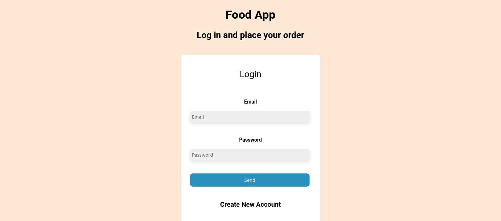

# Food App Creada con Node y MongoDB

Hola, bienvenidos al repositorio Food App (Demo).

## Comenzando 🚀

Para hacerlo funcionar, te invito a clonar o forkear el repo. Una vez descargado, abre la terminal de comandos y ubicate en la carpeta del proyecto.

## Configuración y Variables De Entorno ⚙️

Deberás acceder la página de [MongoDB Atlas](https://www.mongodb.com/atlas/database) y registrarte de forma gratuita, luego crearas una instancia de base de datos y luego obtener los datos completos para la uri de conección o bién conectarte a una base de datos de MongoDB local en tu equipo. Deberás crear un archivo .env en la raíz del proyecto, dentro del mismo vas a crear una variable de entorno llamada MONGODB_URI y le vas a asignar el valor de la uri de conección que acabas de obtener de la siguiente manera: MONGODB_URI="mongodb://localhost:27017/food".

## Scripts Disponibles 📌

En el directorio del proyecto puedes ejecutar:

### `npm i ó npm install`

Para instalar todas las dependencias que requiere el proyecto para funcionar.

### `npm run dev`

Corre la aplicación en modo desarrollo un tu servidor local en tu computadora.
Abre [http://localhost:27017](http://localhost:27017) (o en el pueto asignado) para poder interactuar con las rutas del backend.

### `npm start`

Corre la aplicación en modo producción un tu servidor local en tu computadora.
Abre [http://localhost:27017](http://localhost:27017) (o en el pueto asignado) para poder interactuar con las rutas del backend.

Para poder visualizar el cliente en el navegador simplemente ejecuta el archivo index.html en la carpeta food-app-web (este cliente es solo una demo)

## Despliegue 📦

Podrás visitar la aplicación en el siguiente [enlace](https://dbriceno10.github.io/food-app/food-app-web/)

## Construido con 🛠️

HTML, CSS, JavaScript, Node Js, Express Js, MongoDB, Mongoose.

---

⌨️ con ❤️ por [dbriceno10](https://github.com/dbriceno10) 😊
